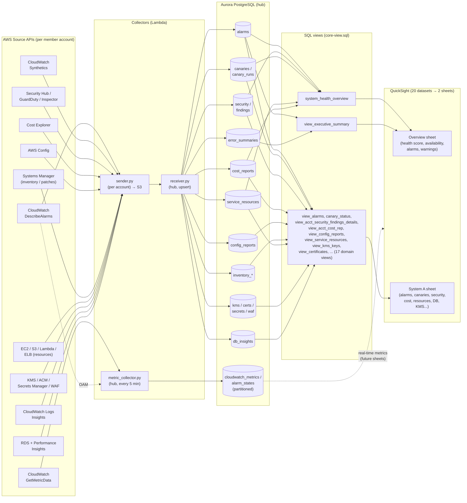

# Data Lineage: Where Every Dashboard Number Comes From

This document traces every piece of data on the dashboard back to its AWS source,
so a new owner can answer "where does this number come from?" for any tile. It also
explains the two collection paths, why there are ~20 QuickSight datasets, and the
design decision on whether to consolidate the Aurora tables.

The chain for every domain is the same shape:

```
AWS source API  ->  collector (Lambda)  ->  Aurora table  ->  SQL view  ->  QuickSight dataset  ->  dashboard visual
```

## Lineage at a glance



---

## 1. Two collection paths

There are **two independent pipelines** that both land in the same Aurora
PostgreSQL database. Knowing which path a number came from is the key to reasoning
about it.

### Path A — S3 batch (the main path, backs almost every dashboard tile)

```
member account                         hub account
┌──────────────┐   JSON    ┌────────┐   read   ┌───────────┐  upsert  ┌────────────┐
│  sender.py   │ ────────> │  S3    │ ───────> │ receiver.py│ ───────> │  Aurora     │
│ (per account)│  to S3    │ bucket │  trigger │  (hub)     │  tables  │  base tables│
└──────────────┘           └────────┘          └───────────┘          └────────────┘
```

- **`sender.py`** runs in each member (source) account on a schedule, calls AWS
  read-only APIs, and writes one JSON file to the hub S3 bucket.
- **`receiver.py`** runs in the hub, is triggered by the S3 upload, and UPSERTs the
  JSON into the Aurora base tables.
- QuickSight reads the **`view_*` views** layered on those base tables.

### Path B — RDS Data API direct (real-time metrics)

```
┌───────────────────┐  cloudwatch:GetMetricData   INSERT    ┌───────────────────────────┐
│ metric_collector.py│ ──────(cross-account OAM)──────────> │ cloudwatch_metrics /        │
│ (hub, every 5 min) │                                      │ alarm_states (partitioned)  │
└───────────────────┘                                       └───────────────────────────┘
```

- **`metric_collector.py`** runs in the hub every 5 minutes, reads CloudWatch
  metrics from all linked accounts via **Cross-Account Observability (OAM)**, and
  writes **directly** into two time-series tables using the RDS Data API. It does
  **not** go through S3 or `receiver.py`.
- These two tables (`cloudwatch_metrics`, `alarm_states`) are **weekly-partitioned**
  by `collected_at`. They feed the real-time metrics datasets, not the executive/
  health rollup.

> The two paths deliberately do not overlap: Path A carries the daily inventory,
> security, cost, alarm, and canary data behind the current dashboard sheets; Path B
> carries the high-frequency metric time-series.

---

## 2. Full lineage table (per dashboard dataset)

Every QuickSight dataset in the shipped bundle, traced end to end. All 20 datasets
are used by at least one visual (there are no redundant datasets).

| QuickSight dataset | SQL view (dataset source) | Aurora base table(s) | Collector function (file) | AWS source API |
|---|---|---|---|---|
| `alarms` | `view_alarms` | `alarms`, `alarm_history` | `collect_cloudwatch_alarms` → `process_alarms` (sender/receiver) | `cloudwatch:DescribeAlarms` (+ alarm history) |
| `canary_status` | `canary_status` | `canaries`, `canary_runs` | `collect_canaries` → `process_canaries` | `synthetics:DescribeCanaries`, `GetCanaryRuns` |
| `view_acct_security_findings_details` | `view_acct_security_findings_details` | `findings`, `security` | `get_security_hub` / `_process_finding` → `load_security_data` | `securityhub:GetFindings` |
| `view_kms_keys` | `view_kms_keys` | `kms_keys` | `get_kms_security` | `kms:ListKeys`, `DescribeKey` |
| `view_waf_rules_detailed` | `view_waf_rules_detailed` | `waf_rules_detailed` | `get_waf_rules` | `wafv2:ListWebACLs`, `GetWebACL` |
| `view_certificates` | `view_certificates` | `certificates` | `get_certificate_security` | `acm:ListCertificates`, `DescribeCertificate` |
| `view_secrets_manager_secrets` | `view_secrets_manager_secrets` | `secrets_manager_secrets` | `get_secrets_security` | `secretsmanager:ListSecrets`, `DescribeSecret` (never reads values) |
| `view_config_reports` | `view_config_reports` | `config_reports` | `get_config` → `load_config_data` | `config:DescribeComplianceByConfigRule` |
| `view_non_compliant_resources` | `view_non_compliant_resources` | `non_compliant_resources`, `config_reports` | `get_config` → `load_config_data` | `config:*` compliance |
| `view_service_resources` | `view_service_resources` | `service_resources` | `get_services_resources` | multi-service (`ec2`, `s3`, `lambda`, `elbv2`, …) |
| `view_inventory_instances` | `view_inventory_instances` | `inventory_instances` | `get_inventory` | `ssm` inventory / `DescribeInstanceInformation` |
| `view_inventory_patches` | `view_inventory_patches` | `inventory_patches`, `inventory_instances` | `get_inventory` / `get_patch_details` | `ssm:DescribeInstancePatches` |
| `view_acct_cost_rep` | `view_acct_cost_rep` | `cost_reports` (+ `service_costs`, `cost_forecasts`) | `get_cost` → `load_cost_data` | `ce:GetCostAndUsage` |
| `view_acct_serv` | `view_acct_serv` | `services` | `get_services` → `load_service_data` | Cost Explorer service usage |
| `db_insights` | `view_db_insights` | `db_insights`, `db_events` | `collect_db_insights` → `process_db_insights` | `rds:DescribeDBInstances`/`DescribeEvents`, `pi:GetResourceMetrics` |
| `error_summaries` | `view_error_summaries` | `error_summaries` | `collect_error_logs` → `process_error_logs` | CloudWatch Logs Insights (`logs:StartQuery`) |
| `view_accounts` | `view_accounts` | `accounts`, `products`, `product_accounts` | `get_account_details` → `load_account_data` | `account:*`, `sts:GetCallerIdentity` |
| `view_product_summary` | `view_product_summary` | `accounts`, `products`, `product_accounts` (+ account-scoped rollups) | `get_account_details` (product from account payload) | derived |
| `executive_summary` | `view_executive_summary` | `accounts` + `alarms` + `incidents` + `canaries` + `error_summaries` | multiple (rollup) | derived rollup |
| `system_health_overview` | `system_health_overview` | `products`, `product_accounts`, `accounts`, `alarms`, `security`, `canaries`, `service_resources`, `cost_reports` | multiple (composite score) | derived rollup — see [health-scoring.md](quicksight/health-scoring.md) |

> **Reading the table:** for any tile, find its dataset (QuickSight → the visual's
> field well shows the dataset), then read left-to-right to see the view, the table,
> the collector, and the original AWS API. Example: the *System Availability* tile →
> `canary_status` dataset → `canary_status` view → `canaries`+`canary_runs` tables →
> `collect_canaries` → `synthetics:DescribeCanaries`.

### The two composite (rollup) datasets

- **`system_health_overview`** — the Overview page health score. It reads alarms,
  security findings, canaries, service resources, and cost, and computes the
  penalty-based score. Full formula and per-tile derivation:
  [docs/quicksight/health-scoring.md](quicksight/health-scoring.md).
- **`executive_summary`** — per-account KPI counts (critical/high/medium alarms,
  active incidents, canary failures, total errors) from `accounts` joined to
  `alarms`, `incidents`, `canaries`, `error_summaries`.

---

## 3. The view layer (why datasets read views, not tables)

Every dataset reads a **`view_*` view**, not a raw table. The views all follow one
pattern: the base table joined to `accounts` (and to `products` via
`product_accounts`) to enrich each row with account id, account name, region,
category, environment, and product/system name. This is what lets the dashboard
filter every visual by System / Account / Category / Environment consistently.

So the account/system columns you see on almost every visual come from this join —
they are **not** duplicated into each base table.

---

## 4. Tables that exist but are NOT on the current dashboard

The schema collects more than the two shipped sheets display. These are populated
but not surfaced by the Overview/System sheets (they are available for you to build
additional sheets on):

- **`cloudwatch_metrics`, `alarm_states`** (Path B, partitioned) — feed the
  real-time metrics datasets; no `view_*` wrapper. The Overview alarm signals come
  from the `alarms` table (Path A), not `alarm_states`.
- **`guard_duty_findings`, `inspector_findings`, `cloudtrail_logs`,
  `compute_optimizer`, `marketplace_usage`, `trusted_advisor_checks`,
  `health_events`, `application_signals`, `resilience_hub_apps`, `support_tickets`,
  `ri_sp_daily_savings`** — each has an enrichment view but is not wired into the
  Overview/System sheets or the health score.
- **`alarm_history`, `db_events`** — populated as history/detail; no dedicated
  dashboard visual.

### One known gap: `incidents`

`view_executive_summary` and (indirectly) the health rollup reference the
**`incidents`** table, but **there is no incident collector in `sender.py`**. The
`incidents` table is only populated if an upstream source feeds an `incidents`
payload to the receiver. On a default deployment `incidents` stays empty, so the
"active incidents" count reads 0. This is expected, not a bug — wire an incident
source (e.g. an EventBridge rule to the receiver) if you want it populated.

---

## 5. Recommendation: keep the current table design (do NOT consolidate)

A natural question when taking ownership is "can we merge these ~20 tables/datasets
into fewer?" Our recommendation is **no — keep them separate**, for three reasons:

1. **Each domain has a genuinely different schema.** Alarms, canaries, security
   findings, cost, KMS keys, certificates, patches, and WAF rules have different
   columns from different AWS APIs. Merging them into a wide shared table would mean
   many null columns and a schema that is *harder* to understand, not easier.
2. **One table ↔ one collector ↔ one view ↔ one dataset is the thing that makes the
   pipeline traceable.** The 1:1:1 mapping in the table above is exactly the clarity
   you want. Consolidation would break that clean mapping.
3. **No redundancy exists to remove.** All 20 datasets are used by visuals; every
   base table behind a dashboard view is written by a collector. There is no dead
   table or dataset to prune (the earlier "42 datasets" seen in the console was
   duplicate copies from iterative testing, since cleaned up — the shipped bundle
   has exactly 20).

If you later want *fewer datasets in QuickSight* specifically, the safe lever is to
build additional **views** that pre-join domains for a specific sheet — not to merge
the underlying tables. That keeps ingestion simple while giving the dashboard a
simpler surface.

---

## 6. Quick reference: verifying a tile's data live

To confirm where a tile's data comes from, query the backing table directly:

```sql
-- e.g. is the "System Availability" tile empty because there are no canaries?
SELECT COUNT(*) FROM canaries;          -- 0 rows => tile correctly shows "No data"

-- how many security findings back the Security sheet?
SELECT critical_count, high_count, medium_count FROM security;
```

A tile showing **"No data to display"** almost always means the backing table has
zero rows for the current filters (the source service isn't in use in that account)
— see [quicksight/README.md](../quicksight/README.md#understanding-no-data-to-display-tiles)
for the empty-vs-broken distinction.
